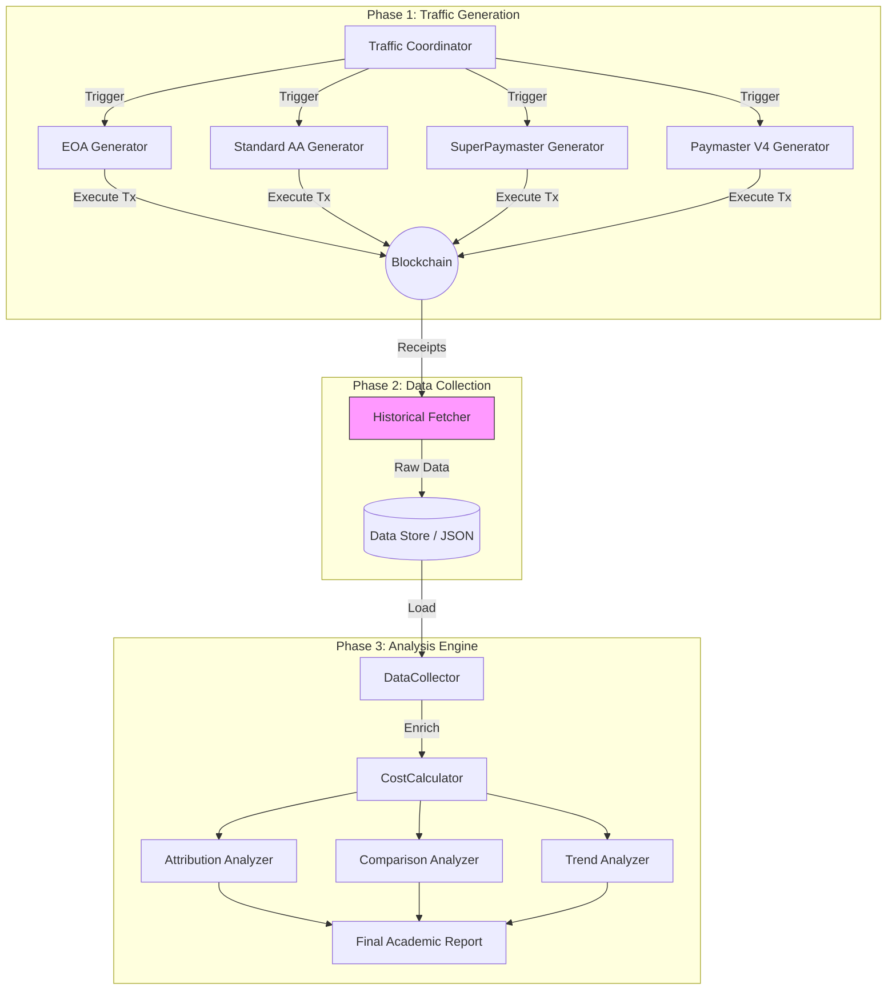

# 📊 AAStar Gas Analytics & Experimentation

> **Status**: Active | **Version**: 3.0 (PhD Research Edition)

This module is the core data intelligence engine for the AAStar ecosystem. It has been upgraded to support **Scientific Data Collection** for the "Asset-Oriented Abstraction" thesis, moving beyond simple log analysis to rigorous, on-chain ground truth verification.
工作流：

收集数据（日常运行）：
pnpm tsx scripts/run_analytics_coordinator.ts --network sepolia
产生新实验数据（需要时运行）：
pnpm tsx scripts/run_analytics_coordinator.ts --network sepolia --gen-traffic

收集events
pnpm tsx scripts/run_analytics_coordinator.ts --network sepolia --fetch-events

分析报告（查看结果）：
pnpm tsx packages/analytics/src/gas-analyzer-v4.ts --network sepolia

步骤是解耦的，按需执行即可
---

## 🏗 System Architecture

The Analytics module operates on a **Pipeline Architecture** composed of three distinct stages: **Generation**, **Collection**, and **Analysis**.



---

## 🧩 Key Modules

### 1. Traffic Generators (`src/generators/`)
Responsible for creating controlled, verifiable traffic patterns on testnets (Sepolia, OP Sepolia) and mainnets.
- **EOAGenerator**: Baseline ETH transfers to measure intrinsic network costs.
- **StandardAAGenerator**: ERC-4337 flows using industry-standard Paymasters (Pimlico/Alchemy).
- **SuperPaymasterGenerator**: **Treatment Group**. Uses the `EndUserClient` to execute gasless transactions via the "Credit/Asset-Oriented" model (Dual-Token).
- **PaymasterV4Generator**: **Treatment Group B**. Uses the "Deposit" model (Single-Token) for comparative analysis.

### 2. Data Collectors (`src/collectors/`)
Responsible for gathering "Ground Truth" data.
- **HistoricalFetcher**: Connects to Etherscan/OptimismScan APIs to retrieve full transaction histories for test accounts defined in `l4-state.json`. **Crucial for auditability.**
- **LogParser**: Legacy parser for development logs (kept for backward compatibility).

### 3. Analysis Engine (`src/core/` & `src/analyzers/`)
The brain of the operation.
- **Double-Layer Analysis**:
    - **Intrinsic Layer**: Gas used, Blob gas, Calldata efficiency.
    - **Economic Layer**: USD costs, Protocol Revenue, Net Profit.
- **Attribution**: Breaks down cost into L1 Security, L2 Execution, and Protocol Overhead.

---

## 🚀 Workflows

### A. Run Full Experiment (Coordinator)
The `run_analytics_coordinator.ts` script orchestrates the entire lifecycle.

```bash
# 1. Fetch History -> 2. Generate Missing Traffic -> 3. Analyze
npx tsx scripts/run_analytics_coordinator.ts --network sepolia
```

### B. Fetch Historical Data Only
Useful for auditing existing accounts without spending gas.
```bash
npx tsx scripts/run_analytics_coordinator.ts --fetch-only --network op-sepolia
```

### C. Traffic Generation Only
Generate a specific number of transactions for a specific group.
```bash
npx tsx packages/analytics/src/generators/cli.ts --group superpaymaster --runs 10
```

---

## 📊 Data & Metrics

We prioritize **Intrinsic Metrics** to ensure scientific validity independent of market volatility.

| Metric | Definition | Source |
| :--- | :--- | :--- |
| **Gas Used** | Total gas consumed by the transaction | `receipt.gasUsed` |
| **L1 Fee** | Cost of posting data to L1 (for L2s) | Oracle Contract / Header |
| **Latency** | Time from `UserOp` submission to inclusion | Client-side Timestamp |
| **Steps** | Number of signatures/interactions required | Protocol Definition |

---

## 📂 Directory Structure

```text
packages/analytics/
├── src/
│   ├── generators/       # [NEW] Traffic Generation Logic
│   ├── collectors/       # [NEW] Etherscan/RPC Fetchers
│   ├── core/             # Core Analysis Engines
│   ├── analyzers/        # Specific Analysis Strategies
│   └── gas-analyzer.ts   # Main Entry Point
├── data/                 # Raw JSON Data Store
└── reports/              # HTML/Markdown Reports
```