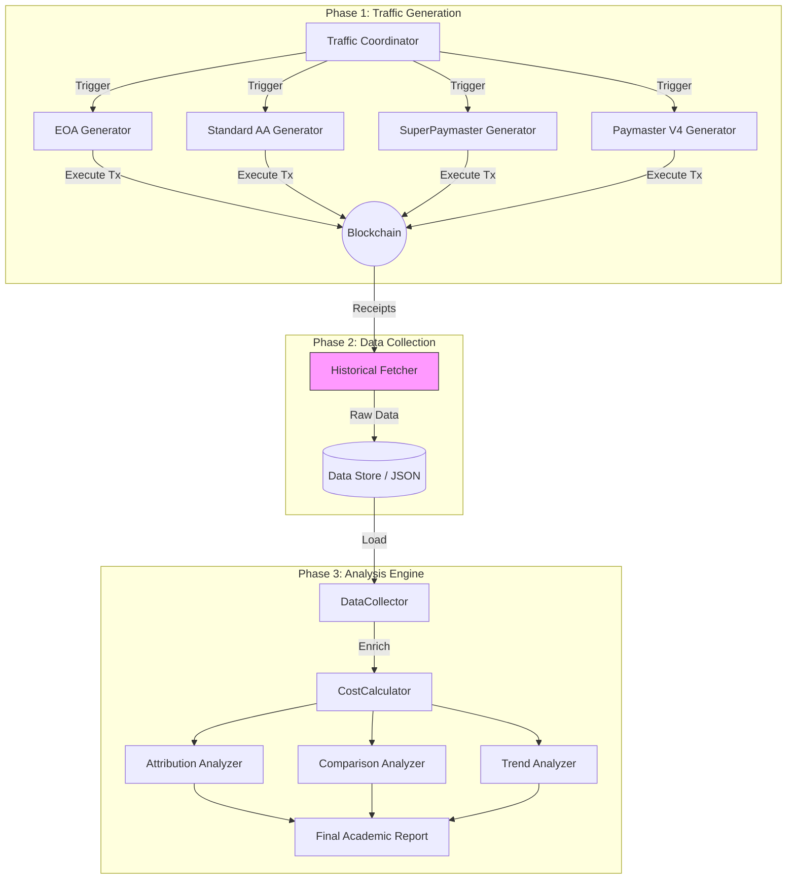

# Analytics Package (AAStar Gas Analytics & Experimentation)

> **Status**: Active | **Version**: 3.0 (PhD Research Edition)

This module is the core data intelligence engine for the AAStar ecosystem. It supports **Scientific Data Collection** for the "Asset-Oriented Abstraction" thesis with rigorous, on-chain ground truth verification.

```bash
# 快速入口（从 aastar-sdk 根目录运行）

# 收集 OP Mainnet paymaster 基线
pnpm tsx packages/analytics/scripts/collect_paymaster_baselines.ts --network op-mainnet --n 50

# 收集 Paper7 专属数据
bash packages/analytics/scripts/run_paper7_exclusive_data.sh --network anvil --cycles 5

# 全流程协调器
pnpm tsx packages/analytics/scripts/run_analytics_coordinator.ts --network sepolia

# Gas 分析报告文档
packages/analytics/docs/OP_Mainnet_Gas_Analysis_Report.md
```

---

## System Architecture

The Analytics module operates on a **Pipeline Architecture** composed of three distinct stages: **Generation**, **Collection**, and **Analysis**.



---

## Directory Structure

```text
packages/analytics/
├── src/
│   ├── generators/           # Traffic Generation Logic
│   ├── collectors/           # Etherscan/RPC Fetchers
│   │   └── EventFetcher.ts   # On-chain UserOperationEvent collector
│   ├── core/                 # Core Analysis Engines
│   ├── analyzers/            # Specific Analysis Strategies
│   └── gas-analyzer.ts       # Main Entry Point
├── scripts/                  # ← All data collection scripts (consolidated)
│   ├── collect_paymaster_baselines.ts   # OP mainnet V4/SuperPM baselines
│   ├── collect_eoa_erc20_baseline.ts    # EOA ERC20 transfer baseline
│   ├── collect_industry_baseline.ts     # Alchemy/Pimlico baselines
│   ├── compute_cost_summary.ts          # Aggregated cost breakdown table
│   ├── gasless-collect.ts               # Gasless data collector (OP mainnet)
│   ├── paper7-exclusive-data.ts         # Paper7 closed-loop data (anvil)
│   ├── paper7_credit_loop.ts            # Credit→Debt→Repay cycle runner
│   ├── paper7_reputation_credit.ts      # Reputation→Credit mapping runner
│   ├── run_analytics_coordinator.ts     # Full pipeline coordinator
│   ├── run_paper7_exclusive_data.sh     # Paper7 shell wrapper (CI-friendly)
│   ├── fetch-tx-hashes.ts               # TX hash fetcher utility
│   └── scrape-tx.ts                     # Puppeteer Etherscan scraper
├── docs/                     # ← Research reports and analysis documents
│   └── OP_Mainnet_Gas_Analysis_Report.md  # Paper3/Paper7 gas cost evidence
├── data/                     # Raw data store
│   ├── gasless_data_collection.csv      # T1/T2/T2.1/T5 baseline (v1)
│   ├── gasless_data_collection_v2.csv   # Controlled single-UserOp (v2)
│   ├── gasless_metrics_detailed.csv     # Full L1/L2 fee decomposition
│   ├── industry_paymaster_baselines.csv # Alchemy, Pimlico on-chain baselines
│   ├── eoa_erc20_baseline.csv           # Raw EOA transfer baseline
│   ├── paper7_exclusive/               # Paper7 credit/reputation/liquidity
│   └── paper_gas_op_mainnet/           # Paper3 per-date controlled datasets
│       ├── 2026-02-17/                 # V4 n=36, SuperPM n=43
│       └── 2026-02-18/                 # V4/SuperPM with sender (n=50)
└── reports/                  # HTML/Markdown summaries
```

---

## Workflows

### A. Collect OP Mainnet Paymaster Baselines (Paper3)
```bash
# V4 baseline: strict single UserOp + ERC20 transfer filter
pnpm tsx packages/analytics/scripts/collect_paymaster_baselines.ts \
  --network op-mainnet --type v4 --n 50 --strict-transfer --single-userop

# SuperPaymaster baseline
pnpm tsx packages/analytics/scripts/collect_paymaster_baselines.ts \
  --network op-mainnet --type super --n 50
```

### B. Run Full Experiment (Coordinator)
```bash
# 1. Fetch History -> 2. Generate Missing Traffic -> 3. Analyze
pnpm tsx packages/analytics/scripts/run_analytics_coordinator.ts --network sepolia
```

### C. Fetch Historical Data Only
```bash
pnpm tsx packages/analytics/scripts/run_analytics_coordinator.ts --fetch-only --network op-sepolia
```

### D. Transaction Scraper (Etherscan)
Reads from `data/gasless_data_collection.csv`, outputs to `data/gasless_metrics_detailed.csv`.
```bash
pnpm tsx packages/analytics/scripts/scrape-tx.ts
```

---

## Data Directory

| File | Description |
|------|-------------|
| `data/gasless_data_collection.csv` | T1/T2/T2.1/T5 records with TxHash + Label |
| `data/gasless_data_collection_v2.csv` | High-fidelity controlled dataset (single-UserOp, ERC20) |
| `data/gasless_metrics_detailed.csv` | L1 Fee, L2 Fee, Gas Used (Puppeteer scraped) |
| `data/industry_paymaster_baselines.csv` | Alchemy (mean=257k) + Pimlico (mean=387k) on-chain baselines |
| `data/eoa_erc20_baseline.csv` | Raw EOA ERC20 transfer baseline |
| `data/paper7_exclusive/` | Credit cycle + reputation + liquidity simulation (Anvil) |
| `data/paper_gas_op_mainnet/2026-02-17/` | V4 n=36, SuperPM n=43 (strict filter) |
| `data/paper_gas_op_mainnet/2026-02-18/` | V4/SuperPM with sender field (n=50) |

---

## Paper7 Exclusive Data (Credit / Reputation / Liquidity)

Paper7 requires a distinct set of evidence to prove **CommunityFi closed-loop semantics**:

- **Reputation → Credit**: contribution/reputation synced into Registry, credit limit observed to change
- **Credit → Debt → Repay**: debt recorded in Paymaster/Registry, cleared via xPNTs
- **Liquidity (Baseline)**: simulation curve showing gas-redeemable vs non-redeemable points over time

### Running

```bash
# Unified entry (Anvil auto-start, deploy, sync, run all subtasks)
pnpm exec tsx packages/analytics/scripts/paper7-exclusive-data.ts --network anvil --cycles 5

# Shell wrapper (CI-friendly)
bash packages/analytics/scripts/run_paper7_exclusive_data.sh --network anvil --cycles 5
```

### Output Structure

```text
data/paper7_exclusive/<timestamp>/
  credit_cycle_1.json    # credit→debt→repay per account
  ...
  reputation_credit.json # reputation sync → credit limit mapping
  liquidity_velocity_simulation.csv
  synced_config.anvil.json
```

#### `credit_cycle_*.json` fields
- `creditLimitWei / creditLimitEth`: credit limit in Registry
- `debtBeforeWei / debtAfterRecordWei / debtAfterRepayWei`: debt lifecycle
- `gasUsed.*`: per-step gas units (approve, setCreditTier, recordDebt, mint)

#### `reputation_credit.json` fields
- `score` / `globalReputation` / `creditLimitWei`: reputation → credit mapping
- `gasUsed.*`: setRule, syncToRegistry, etc.

#### `liquidity_velocity_simulation.csv` columns
- `day`: simulation step
- `points_gas_redeemable`: points stock when gas-redeemable
- `points_baseline`: points stock without gas redemption

---

## Key Modules

### 1. Traffic Generators (`src/generators/`)
- **EOAGenerator**: Baseline ETH transfers for network cost measurement.
- **SuperPaymasterGenerator**: Treatment group — credit/asset-oriented gasless model.
- **PaymasterV4Generator**: Treatment group B — deposit model for comparison.

### 2. Data Collectors (`src/collectors/`)
- **HistoricalFetcher**: Etherscan/OptimismScan API for full transaction histories.
- **EventFetcher**: On-chain `UserOperationEvent` log collector with strict filtering.

### 3. Analysis Engine (`src/core/` & `src/analyzers/`)
- **Attribution**: L1 Security | L2 Execution | Protocol Overhead breakdown.
- **Comparison**: T1 vs T2 vs T2.1 vs T5 vs industry baselines.


> **Status**: Active | **Version**: 3.0 (PhD Research Edition)

This module is the core data intelligence engine for the AAStar ecosystem. It has been upgraded to support **Scientific Data Collection** for the "Asset-Oriented Abstraction" thesis, moving beyond simple log analysis to rigorous, on-chain ground truth verification.
工作流：

收集数据（日常运行）：
pnpm tsx scripts/run_analytics_coordinator.ts --network sepolia
产生新实验数据（需要时运行）：
pnpm tsx scripts/run_analytics_coordinator.ts --network sepolia --gen-traffic

收集events
pnpm tsx scripts/run_analytics_coordinator.ts --network sepolia --fetch-events

分析报告（查看结果）：
pnpm tsx packages/analytics/src/gas-analyzer-v4.ts --network sepolia

步骤是解耦的，按需执行即可
---

## 🏗 System Architecture

The Analytics module operates on a **Pipeline Architecture** composed of three distinct stages: **Generation**, **Collection**, and **Analysis**.


---

## 🧩 Key Modules

### 1. Traffic Generators (`src/generators/`)
Responsible for creating controlled, verifiable traffic patterns on testnets (Sepolia, OP Sepolia) and mainnets.
- **EOAGenerator**: Baseline ETH transfers to measure intrinsic network costs.
- **StandardAAGenerator**: ERC-4337 flows using industry-standard Paymasters (Pimlico/Alchemy).
- **SuperPaymasterGenerator**: **Treatment Group**. Uses the `EndUserClient` to execute gasless transactions via the "Credit/Asset-Oriented" model (Dual-Token).
- **PaymasterV4Generator**: **Treatment Group B**. Uses the "Deposit" model (Single-Token) for comparative analysis.

### 2. Data Collectors (`src/collectors/`)
Responsible for gathering "Ground Truth" data.
- **HistoricalFetcher**: Connects to Etherscan/OptimismScan APIs to retrieve full transaction histories for test accounts defined in `l4-state.json`. **Crucial for auditability.**
- **LogParser**: Legacy parser for development logs (kept for backward compatibility).

### 3. Analysis Engine (`src/core/` & `src/analyzers/`)
The brain of the operation.
- **Double-Layer Analysis**:
    - **Intrinsic Layer**: Gas used, Blob gas, Calldata efficiency.
    - **Economic Layer**: USD costs, Protocol Revenue, Net Profit.
- **Attribution**: Breaks down cost into L1 Security, L2 Execution, and Protocol Overhead.

---

## 🚀 Workflows

### A. Run Full Experiment (Coordinator)
The `run_analytics_coordinator.ts` script orchestrates the entire lifecycle.

```bash
# 1. Fetch History -> 2. Generate Missing Traffic -> 3. Analyze
npx tsx scripts/run_analytics_coordinator.ts --network sepolia
```

### B. Fetch Historical Data Only
Useful for auditing existing accounts without spending gas.
```bash
npx tsx scripts/run_analytics_coordinator.ts --fetch-only --network op-sepolia
```

### C. Traffic Generation Only
Generate a specific number of transactions for a specific group.
```bash
npx tsx packages/analytics/src/generators/cli.ts --group superpaymaster --runs 10
```

---

## 📊 Data & Metrics

We prioritize **Intrinsic Metrics** to ensure scientific validity independent of market volatility.

| Metric | Definition | Source |
| :--- | :--- | :--- |
| **Gas Used** | Total gas consumed by the transaction | `receipt.gasUsed` |
| **L1 Fee** | Cost of posting data to L1 (for L2s) | Oracle Contract / Header |
| **Latency** | Time from `UserOp` submission to inclusion | Client-side Timestamp |
| **Steps** | Number of signatures/interactions required | Protocol Definition |

---

## 📂 Directory Structure

```text
packages/analytics/
├── src/
│   ├── generators/       # [NEW] Traffic Generation Logic
│   ├── collectors/       # [NEW] Etherscan/RPC Fetchers
│   ├── core/             # Core Analysis Engines
│   ├── analyzers/        # Specific Analysis Strategies
│   └── gas-analyzer.ts   # Main Entry Point
├── data/                 # Raw JSON Data Store
└── reports/              # HTML/Markdown Reports
```

---

## 🕷️ Transaction Scraper

A Puppeteer-based scraper to extract detailed gas and fee metrics from Optimism Etherscan.

### Prerequisites

- Node.js & pnpm
- Chrome browser (Puppeteer will attempt to install this automatically, but you can run `npx puppeteer browsers install chrome` if needed)

### Running the Scraper

The scraper reads transaction hashes from `data/gasless_data_collection.csv` and outputs enriched metrics to `data/gasless_metrics_detailed.csv`.

```bash
pnpm tsx scripts/scrape-tx.ts
```

## 📂 Data Directory (Paper7 Ground Truth)

- `data/gasless_data_collection.csv`: 输入文件，包含 `Timestamp,Label,TxHash`，用于抓取交易详情。
- `data/gasless_data_collection_v2.csv`: 主网/测试网的高保真样本集合（包含 `GasUsed(L2)`, `L2ExecutionFee(Wei)`, `L1DataFee(Wei)` 等列），用于论文/报告里的“真实网络成本与可用性”对照。
- `data/gasless_metrics_detailed.csv`: 抓取后的明细输出（L1 Fee, L2 Fee, Gas Used 等），主要由 `scripts/scrape-tx.ts` 生成。

---

## 🧪 Paper7 专属数据：Credit / Reputation / Liquidity Loop

Paper7 需要一组**与通用 gasless 基线不同**的专属证据，用来证明 CommunityFi 的闭环语义成立（而不仅是“能跑通 gasless”）：

- **Reputation → Credit**：将贡献/声誉同步进 Registry，并观察信用额度随之变化
- **Credit → Debt → Repay**：在 Paymaster/Registry 侧记录债务，再用 xPNTs 完成清算归零
- **Liquidity（Baseline Liquidity）**：用可复现实验/仿真曲线展示“积分可用于偿债/赞助”对流动性速度的影响（作为机制层证据，不依赖市场价格）

### 1) 如何运行（推荐）

统一入口脚本（负责启动 Anvil、必要时自动部署并同步配置，然后跑各子任务）：

```bash
pnpm exec tsx scripts/paper7-exclusive-data.ts --network anvil --cycles 5
```

等价的 shell 包装（更适合 CI/重复跑批）：

```bash
./packages/analytics/run_paper7_exclusive_data.sh --network anvil --cycles 5
```

### 2) 脚本目标与流程定位

- `scripts/paper7-exclusive-data.ts`
  - **目标**：生成 Paper7 专属闭环数据（credit cycles + reputation→credit + liquidity simulation）。
  - **作用位置**：属于“可重复的受控实验层”，用 gas units 固定地刻画合约路径开销与状态变化，避免 ETH/USD 等市场变量污染结论。
- `scripts/paper7_credit_loop.ts`
  - **目标**：跑一次完整 **credit→debt→repay** 闭环（Anvil-only，依赖 `anvil_*` RPC）。
  - **产出**：每次运行写一个 `credit_cycle_*.json`。
- `scripts/paper7_reputation_credit.ts`
  - **目标**：跑一次 **reputation sync → registry credit update**，并记录关键读数与每笔交易 gasUsed。
  - **产出**：写 `reputation_credit.json`。
- `liquidity_velocity_simulation.csv`
  - **目标**：给论文提供“Baseline Liquidity 机制”的直观趋势证据（对比可用于 gas 清算 vs 不可清算时，积分存量随时间的衰减/累积差异）。

### 3) 数据产物（在哪里、是什么、怎么看）

所有 Paper7 专属数据默认写入：

`packages/analytics/data/paper7_exclusive/<timestamp>/`

典型结构如下：

```text
paper7_exclusive/<timestamp>/
  credit_cycle_1.json
  credit_cycle_2.json
  ...
  reputation_credit.json
  liquidity_velocity_simulation.csv
  anvil.log                # 若自动启动/部署，保留日志便于审计
  deploy.log               # 若触发自动部署，保留 forge 日志便于复现
  synced_config.anvil.json # 若触发自动同步，记录当次使用的合约地址快照
```

#### A) `credit_cycle_*.json`（闭环清算）

每个 cycle 都是一次独立账户的闭环验证，核心字段：

- `creditLimitWei / creditLimitEth`：该账户在 Registry 的信用额度（用于赞助/欠款边界）
- `debtBeforeWei / debtAfterRecordWei / debtAfterRepayWei`：欠款从 0 → 增加 → 清算归零
- `gasUsed.*`：每一步合约调用的 gas units（`approve`, `setCreditTier`, `recordDebt`, `mint`）
- `tx.*`：对应交易哈希（便于回溯 receipts / debug）

#### B) `reputation_credit.json`（声誉到信用映射）

用于证明 Reputation sync 后，Registry 中的 `globalReputation` 与 `getCreditLimit` 发生预期变化，并给出每步 gas units：

- `score`：ReputationSystem 计算出的 score
- `globalReputation`：Registry 聚合后的全局声誉
- `creditLimitWei / creditLimitEth`：映射后的信用额度
- `gasUsed.*`：`setRule`, `setReputationSource`, `setEntropyFactor`, `syncToRegistry`

#### C) `liquidity_velocity_simulation.csv`（基线流动性趋势）

列定义：

- `day`：仿真步（天）
- `points_gas_redeemable`：积分可用于 gas 清算/赞助时的积分存量曲线
- `points_baseline`：积分不可清算（仅基础用途）时的积分存量曲线
