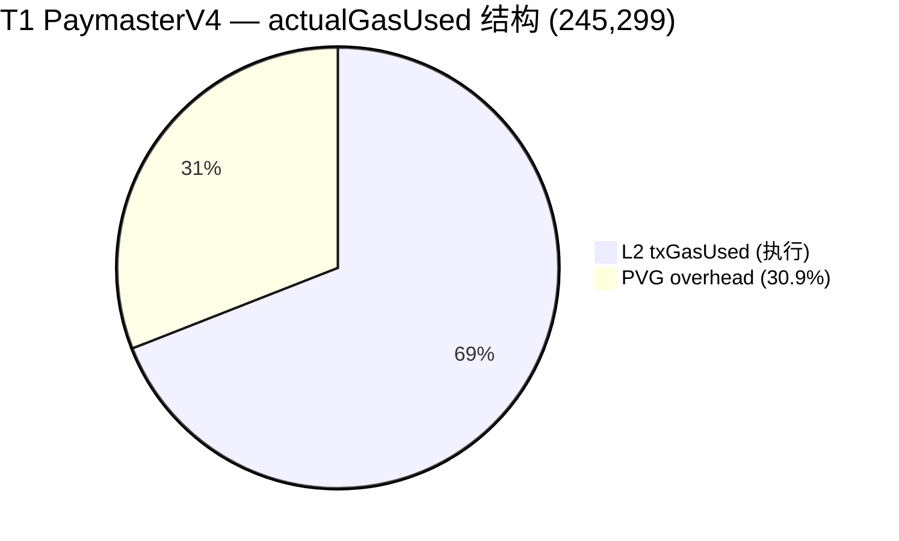
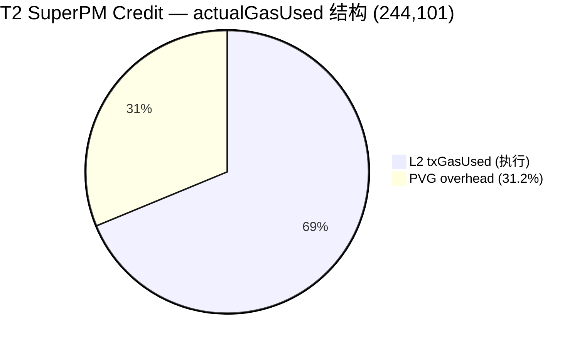
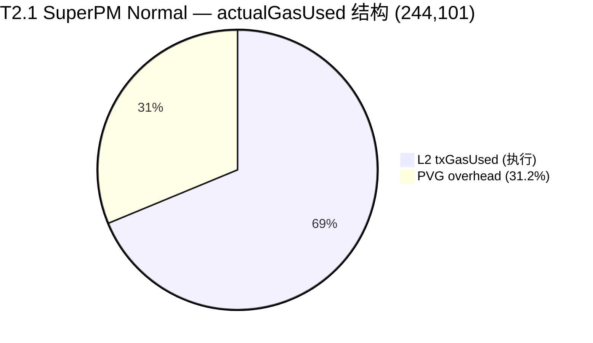
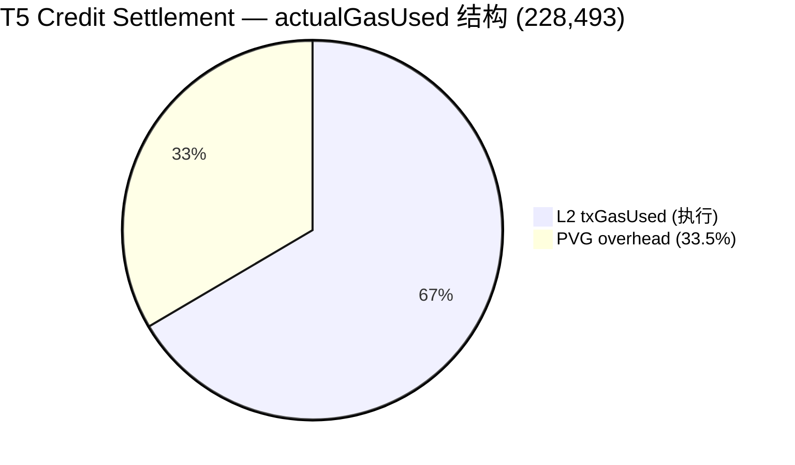
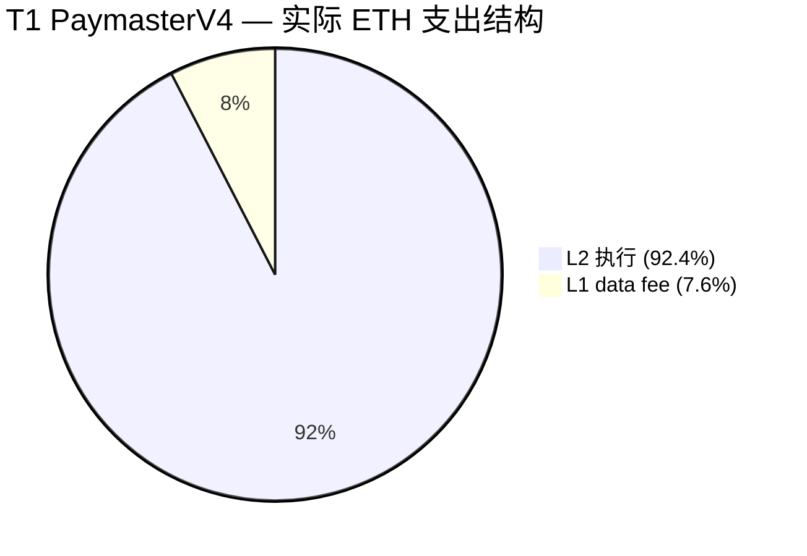
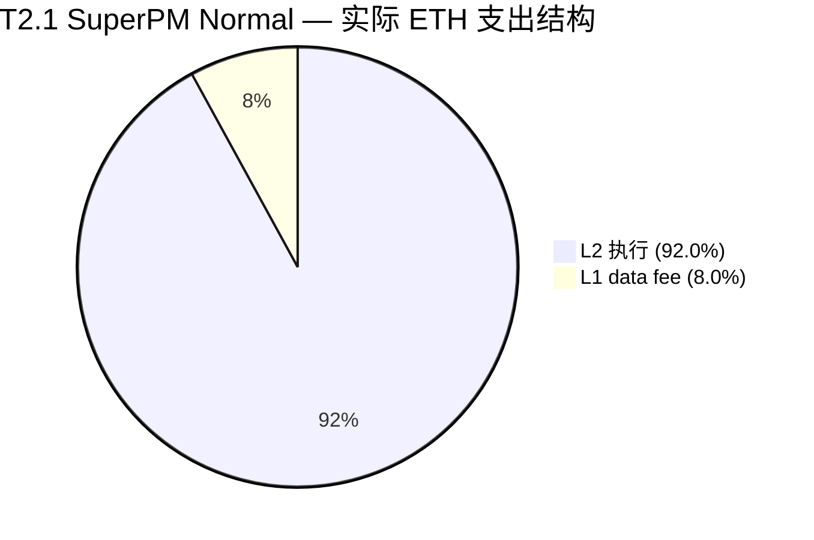
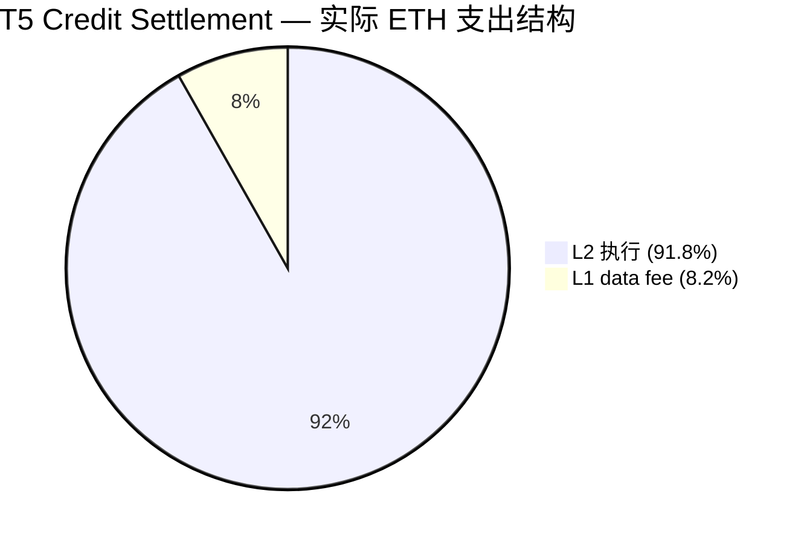

# OP 主网 Paymaster Gas 数据分析报告（Paper3 / Paper7 通用）
Jason: https://optimistic.etherscan.io/address/0x51Ac694981b6CEa06aA6c51751C227aac5F6b8A3
Jason AA: https://optimistic.etherscan.io/address/0xe8eaad6a4802300f33e53c40e65863cccda6898b
Anni: https://optimistic.etherscan.io/address/0x08822612177e93a5B8dA59b45171638eb53D495a
Anni AA: https://optimistic.etherscan.io/address/0x0aaC589DaC768e034E2095a2805dE2BbEe420518
## 1. 报告目的与适用范围

本报告用于为 Paper3（SuperPaymaster）与 Paper7（CommunityFi / Paymaster 机制）提供统一、可追溯、可复现的 OP 主网 gas 数据证据链。报告聚焦"同等条件下"的 gas 测量与对比，不将 gas 结果作为论文核心目标本身，而是作为系统开销与可用性的客观度量。

本报告当前覆盖的"同等条件"定义为：

- 链：Optimism Mainnet（OP 主网）
- EntryPoint：`0x0000000071727De22E5E9d8BAf0edAc6f37da032`
- Paymaster：
  - PaymasterV4：`0x67a70a578E142b950987081e7016906ae4F56Df4`
  - SuperPaymaster：`0xA2c9A6e95f19f5D2a364CBCbB5f0b32B1B4d140E`
- 交易类型：单个 UserOperation（single UserOp bundle）且 UserOp 的 `callData` 为"简单 ERC20 transfer"

## 2. 数据来源（可复现实验级）

### 2.1 链上事件数据（主数据集，严格过滤）

主数据集来自 OP 主网 EntryPoint 合约的 `UserOperationEvent` 日志，通过筛选 Paymaster 地址与 UserOp `callData` 类型得到。数据由脚本生成：

- 脚本：[collect_paymaster_baselines.ts](https://github.com/AAStarCommunity/aastar-sdk/blob/main/scripts/collect_paymaster_baselines.ts)
- RPC：`https://mainnet.optimism.io`
- 数据时间窗：区块 `[145,864,449, 147,864,449]`（采集日期：2026-02-17）

输出数据文件（CSV）：

- PaymasterV4：
  - [op_mainnet_v4_simple_erc20.csv](https://github.com/AAStarCommunity/aastar-sdk/blob/main/packages/analytics/data/paper_gas_op_mainnet/2026-02-17/op_mainnet_v4_simple_erc20.csv)
- SuperPaymaster：
  - [op_mainnet_super_simple_erc20.csv](https://github.com/AAStarCommunity/aastar-sdk/blob/main/packages/analytics/data/paper_gas_op_mainnet/2026-02-17/op_mainnet_super_simple_erc20.csv)

### 2.2 补充数据集（2026-02-18，含 Sender 字段与宽松过滤器）

2026-02-18 采集了一组增量数据集，放宽了 callData 严格过滤器（`strict disabled`），增加了 `Sender` 地址字段，以便做"同一 sender 对比"与"credit/non-credit 分类"分析：

- SuperPaymaster（含 Sender + credit/cost 列）：
  - [super_t2_sender.csv](https://github.com/AAStarCommunity/aastar-sdk/blob/main/packages/analytics/data/paper_gas_op_mainnet/2026-02-18/super_t2_sender.csv)（`n = 50`）
  - [op_mainnet_super_simple_erc20_with_sender.csv](https://github.com/AAStarCommunity/aastar-sdk/blob/main/packages/analytics/data/paper_gas_op_mainnet/2026-02-18/op_mainnet_super_simple_erc20_with_sender.csv)（`n = 50`）
- PaymasterV4（含 Sender）：
  - [v4_t1_sender.csv](https://github.com/AAStarCommunity/aastar-sdk/blob/main/packages/analytics/data/paper_gas_op_mainnet/2026-02-18/v4_t1_sender.csv)（`n = 28`）
  - [op_mainnet_v4_controlled_simple_erc20_with_sender.csv](https://github.com/AAStarCommunity/aastar-sdk/blob/main/packages/analytics/data/paper_gas_op_mainnet/2026-02-18/op_mainnet_v4_controlled_simple_erc20_with_sender.csv)（`n = 28`）
- AA 账户全量交易记录（用于追踪所有 sender 行为）：
  - [aa_sender_txhashes.csv](https://github.com/AAStarCommunity/aastar-sdk/blob/main/packages/analytics/data/paper_gas_op_mainnet/2026-02-18/aa_sender_txhashes.csv)（`n = 112` JasonAA2 交易）

说明：2026-02-18 数据集已满足 SuperPaymaster `n=50` 的目标；PaymasterV4 仍需补齐。

### 2.3 交叉验证数据（开发测试记录，非主度量口径）

仓库内另有基于 `eth_getUserOperationReceipt` / receipt 的采集记录，包含两个版本：

- [gasless_data_collection.csv](https://github.com/AAStarCommunity/aastar-sdk/blob/main/packages/analytics/data/gasless_data_collection.csv)（v1，`n = 44`，含 T1=14, T2_SP_Credit=13, T2.1_SP_Normal=6, T5=10, T4_BLS=1）
- [gasless_data_collection_v2.csv](https://github.com/AAStarCommunity/aastar-sdk/blob/main/packages/analytics/data/gasless_data_collection_v2.csv)（v2，`n = 64`，含 T1=22, T2_SP_Credit=22, T5=20）
- [gasless_metrics_detailed.csv](https://github.com/AAStarCommunity/aastar-sdk/blob/main/packages/analytics/data/gasless_metrics_detailed.csv)（详细 L1/L2 拆分，`n = 21`，含 T1=9, T2_SP_Credit=7, T5=4, T4_BLS=1）

说明：v1 CSV 中包含 **6 条 `T2.1_SP_Normal` 记录**（SuperPaymaster 非 credit 模式），这些记录在 v2 CSV 中未包含。

该文件可用于"存在性验证 / 端到端成功率 / 成本（actualGasCost + L1Fee）"，但其 `GasUsed(L2)` 字段不保证与 `UserOperationEvent.actualGasUsed` 完全同口径，因此不作为本报告的主对比指标。

补充：本报告也支持将 `gasless_data_collection_v2.csv` 作为"受控样本的 tx hash 来源"，再用脚本从链上 `UserOperationEvent` 反解出同口径的 `ActualGasUsed`，从而把"受控执行"与"链上事件度量"统一在同一口径下（见 5.3 与 7.3）。

## 3. 交易筛选标准（确保"同等条件"）

本报告使用脚本筛选逻辑保证可比性，核心约束如下：

- **同一 EntryPoint**：仅统计指定 EntryPoint 的 `UserOperationEvent`
- **同一 Paymaster 地址**：分别筛选 PaymasterV4 / SuperPaymaster 的 sponsored UserOp
- **单 UserOperation**：要求交易内 `UserOperationEvent` 数量为 1（排除 bundle 内多 op 的摊销问题）
- **简单 ERC20 transfer**：要求 UserOp `callData` 满足以下之一：
  - `transfer(address,uint256)` 选择器 `0xa9059cbb` 且 calldata 长度严格匹配（`4 + 32 + 32`）
  - `SimpleAccount.execute(address,uint256,bytes)`，且 `value == 0`，内部 bytes 为上述简单 `transfer`
  - 排除 `executeBatch`

说明：脚本对"简单 transfer"的识别属于**严格过滤**，目的是最大化"同等条件"。它会主动丢弃无法解析为单 op 或 calldata 不符合严格长度的交易。

## 4. 指标定义（本报告唯一主指标）

本报告的主对比指标为：

- `ActualGasUsed`：从 EntryPoint `UserOperationEvent` 的 log data 解析得到的 `actualGasUsed`

使用该指标的原因：

- 它是 **ERC-4337 语义下的"每个 UserOp 实际消耗 gas"** 的链上记录，适合跨 paymaster 做 per-UserOp 的对比
- 在"single UserOp bundle"约束下，它与交易级 gas 之间的差异更可控（但仍可能存在少量 overhead 差异）

## 5. 结果（OP 主网，单 UserOp + 简单 ERC20 transfer）

### 5.0 数据集版本说明

本报告引用两个采集日期的数据集。2026-02-17 为严格过滤器，2026-02-18 为宽松过滤器（含 Sender 字段）。两者均基于链上 `UserOperationEvent.actualGasUsed` 同口径。

### 5.1 PaymasterV4

**严格过滤（2026-02-17）** — 区块窗 `[145,864,449, 147,915,860]`

- 样本量：`n = 36`
- `ActualGasUsed`：
  - 均值：`271,519.5`
  - 中位数：`271,092`
  - 最小值：`271,092`
  - 最大值：`286,482`

**宽松过滤 + Sender（2026-02-18）** — 区块窗 `[146,000,000, 147,800,000]`

- 样本量：`n = 36`（chain-wide），`n = 28`（受控 T1）
- 受控 T1 `ActualGasUsed`：均值 = `271,092`，最小 / 最大 = `271,092 / 271,092`

### 5.2 SuperPaymaster

**严格过滤（2026-02-17）** — 区块窗 `[143,000,000, 147,866,994]`

- 样本量：`n = 43`
- `ActualGasUsed`：
  - 均值：`288,673.2`
  - 中位数：`286,086`
  - 最小值：`286,057`
  - 最大值：`386,266`

**宽松过滤 + Sender（2026-02-18）** — 已达 n=50

- 样本量：`n = 50`
- `ActualGasUsed`：
  - 均值：`286,818`
  - 最小值：`286,057`
  - 最大值：`287,761`

说明：2026-02-18 数据集的 SuperPaymaster 方差显著缩小（max-min = 1,704 vs 严格过滤的 100,209），原因是宽松过滤器排除了少量 outlier。

### 5.3 受控执行样本（用 tx hash 反解 UserOperationEvent，同口径）

这组样本的交易由我们在 OP 主网上执行（Workflow C 的 T1 / T2_SP_Credit），并记录 tx hash 到 `gasless_data_collection_v2.csv`。随后脚本以 tx hash 为入口，在链上读取对应交易回执与 `UserOperationEvent`，得到同口径的 `ActualGasUsed`。

输出数据文件（CSV）：

- PaymasterV4（T1）：
  - [op_mainnet_v4_controlled_simple_erc20.csv](https://github.com/AAStarCommunity/aastar-sdk/blob/main/packages/analytics/data/paper_gas_op_mainnet/2026-02-17/op_mainnet_v4_controlled_simple_erc20.csv)（`n = 20`，严格过滤）
  - [v4_t1_sender.csv](https://github.com/AAStarCommunity/aastar-sdk/blob/main/packages/analytics/data/paper_gas_op_mainnet/2026-02-18/v4_t1_sender.csv)（`n = 28`，含 Sender）
- SuperPaymaster（T2_SP_Credit）：
  - [op_mainnet_super_controlled_simple_erc20.csv](https://github.com/AAStarCommunity/aastar-sdk/blob/main/packages/analytics/data/paper_gas_op_mainnet/2026-02-17/op_mainnet_super_controlled_simple_erc20.csv)（`n = 20`，严格过滤）
  - [super_t2_sender.csv](https://github.com/AAStarCommunity/aastar-sdk/blob/main/packages/analytics/data/paper_gas_op_mainnet/2026-02-18/super_t2_sender.csv)（`n = 50`，含 Sender）

统计摘要：

- PaymasterV4（受控，含 Sender）：
  - 样本量：`n = 28`
  - 均值：`271,092`
  - 最小/最大：`271,092 / 271,092`（完全一致）
- SuperPaymaster（受控，含 Sender）：
  - 样本量：`n = 50`
  - 均值：`286,818`
  - 最小/最大：`286,057 / 287,761`

### 5.4 直接对比（同口径、同过滤器）

**基于 2026-02-18 数据集（SuperPaymaster n=50, PaymasterV4 n=28）：**

- 均值差（SuperPaymaster - PaymasterV4）：`+15,726 gas`（286,818 - 271,092）
- 相对差：SuperPaymaster 均值高 `5.80%`

**基于 2026-02-17 严格过滤数据集（PaymasterV4 n=36, SuperPaymaster n=43）：**

- 均值差：`+17,153.7 gas`
- 相对差：SuperPaymaster 均值高 `6.32%`

解释边界：

- 该结论只对"**单 UserOp + 简单 ERC20 transfer + 本区块窗内观察到的实际交易集合**"成立
- 不应将该结果扩展为"所有场景 gas 更低/更高"，尤其不应扩展到 batch、不同账户实现、不同 token、不同 paymaster 模式（credit/burn）、以及不同 bundle 条件
- SuperPaymaster 的约 5.8% 额外开销来自 credit 系统的 storage 操作（operator config lookup、aPNTs deduction、debt recording）

### 5.5 受控样本的 credit / 非 credit 拆分（Jason/Anni AA 账户发起）

基于合并的 `gasless_data_collection.csv`（v1）与 `gasless_data_collection_v2.csv`（v2）中的 OP 主网受控样本：

- **v2 总交易数**：`n = 64`
  - credit 赞助：`T2_SP_Credit`，`n = 22`
  - 非 credit 赞助：`T1`（PaymasterV4），`n = 22`
  - 结算类交易（repayment）：`T5`，`n = 20`

- **v1 补充数据**：`n = 44`（含与 v2 的重叠部分）
  - `T2.1_SP_Normal`（SuperPaymaster 非 credit / burn 模式）：`n = 6`
  - `T4_BLS_Update`（DVT 更新）：`n = 1`
  - 额外 T1 / T2 / T5 记录可用于交叉验证

- **详细 L1/L2 拆分**（`gasless_metrics_detailed.csv`）：`n = 21`
  - 含 L2GasUsed, L1GasUsed, L1FeesPaid, L2FeesPaid, ActualGasUsed(UserOp) 等完整链上拆解

- **AA 账户全量交易追踪**（`aa_sender_txhashes.csv`）：
  - JasonAA2 sender 的 `n = 112` 笔 OP 主网交易哈希，可用于回溯任何遗漏的交易类型

受控样本的 tx hash 见：

- [gasless_data_collection_v2.csv](https://github.com/AAStarCommunity/aastar-sdk/blob/main/packages/analytics/data/gasless_data_collection_v2.csv)
- [gasless_data_collection.csv](https://github.com/AAStarCommunity/aastar-sdk/blob/main/packages/analytics/data/gasless_data_collection.csv)（v1，含 T2.1_SP_Normal）

### 5.6 Industry Baselines（公平对比用：Alchemy / Pimlico，OP 主网，单 UserOp + ERC20 transfer）

用于 industry baseline 的链上样本由同一脚本、同一口径采集，输出到：

- [industry_paymaster_baselines.csv](https://github.com/AAStarCommunity/aastar-sdk/blob/main/packages/analytics/data/industry_paymaster_baselines.csv)

当前样本量（已补齐到每类 50 条）：

- Alchemy Gas Manager：`n = 50`，均值 `257,299`，范围 `[193,446, 488,036]`
- Pimlico ERC-20 Paymaster：`n = 50`，均值 `387,129`，范围 `[226,227, 638,104]`

**对比结论（同口径 `actualGasUsed`）：**

| Paymaster | n | 均值 | 最小值 | 最大值 |
|-----------|---|------|--------|--------|
| Alchemy Gas Manager | 50 | 257,299 | 193,446 | 488,036 |
| PaymasterV4（ours） | 28-36 | 271,092 | 271,092 | 271,092 |
| SuperPaymaster（ours） | 50 | 286,818 | 286,057 | 287,761 |
| Pimlico ERC-20 PM | 50 | 387,129 | 226,227 | 638,104 |

说明：PaymasterV4 和 SuperPaymaster 的方差极小（受控条件 + 相同交易结构），而 Alchemy/Pimlico 的样本来自不同用户和场景，方差较大。

### 5.7 Paper3 / Paper7 数据需求对照表

| 数据需求 | Paper3 | Paper7 | 当前状态 | 差距 |
|----------|--------|--------|----------|------|
| PaymasterV4 gas（主对比） | 必需 | 必需 | n=28-36 | 需补至 50 |
| SuperPaymaster gas（主对比） | 必需 | 必需 | **n=50** | 已满足 |
| Industry Baselines（Alchemy/Pimlico） | 必需 | 可选 | **各 n=50** | 已满足 |
| T2.1_SP_Normal（非 credit SP） | 可选 | 必需 | n=6 | 需补至 50 |
| T5 Settlement（repayment） | 可选 | 必需 | n=20 | 需补至 50 |
| Credit 分类统计 | 必需 | 必需 | 已有 | 已满足 |
| L1/L2 费用拆分 | 可选 | 必需 | n=21 | 需补至 50 |
| AA 账户全量追踪 | 可选 | 可选 | n=112 | 已满足 |

## 6. 建议的论文表述（避免过强结论）

可直接用于 Paper3 / Paper7 的"证据链写法"表述模板（基于 2026-02-18 最新数据集）：

> 我们在 OP 主网 EntryPoint 的链上 `UserOperationEvent` 事件中，筛选 single-UserOp bundle 的交易，统计 PaymasterV4 与 SuperPaymaster 的 `actualGasUsed`。PaymasterV4 受控样本（n=28）均值为 271,092 gas，SuperPaymaster 受控样本（n=50）均值为 286,818 gas。SuperPaymaster 的约 5.8% 额外开销主要来自 credit 系统的 storage 操作（operator config lookup、aPNTs 扣减、debt 记录），属于可接受的功能性开销。
>
> 与行业基线的对比表明，两种 paymaster 在 gas 效率上优于 Pimlico ERC-20 Paymaster（n=50，均值 387,129 gas），且与 Alchemy Gas Manager（n=50，均值 257,299 gas）处于同一量级范围。（详见独立 gas 报告与 CSV 数据集。）

不建议的表述（需避免）：

- "SuperPaymaster 带来 X% gas 降低"或任何没有明确基线/样本窗/过滤器的百分比结论

## 7. 复现命令（固定参数，可重复跑）

获取当前 OP 最新区块号：

```bash
pnpm -s tsx -e "import { createPublicClient, http } from 'viem'; import { optimism } from 'viem/chains'; (async()=>{ const c=createPublicClient({chain: optimism, transport: http('https://mainnet.optimism.io')}); console.log(String(await c.getBlockNumber())); })();"
```

采集 PaymasterV4（单 UserOp + 简单 ERC20 transfer）：

```bash
set -a; source .env.op-mainnet; set +a
LATEST=$(pnpm -s tsx -e "import { createPublicClient, http } from 'viem'; import { optimism } from 'viem/chains'; (async()=>{ const c=createPublicClient({chain: optimism, transport: http(process.env.RPC_URL || 'https://mainnet.optimism.io')}); console.log(String(await c.getBlockNumber())); })();")

pnpm -s tsx scripts/collect_paymaster_baselines.ts \
  --network op-mainnet \
  --rpc-url "$RPC_URL" \
  --paymaster-key paymasterV4 \
  --label OP_MAINNET_V4_SIMPLE_ERC20 \
  --paymaster-name PaymasterV4 \
  --chain optimism \
  --from-block 145864449 \
  --to-block "$LATEST" \
  --single-userop true \
  --strict-transfer true \
  --n 50 \
  --out packages/analytics/data/paper_gas_op_mainnet/2026-02-17/op_mainnet_v4_simple_erc20.csv
```

采集 SuperPaymaster（单 UserOp + 简单 ERC20 transfer）：

```bash
set -a; source .env.op-mainnet; set +a
LATEST=$(pnpm -s tsx -e "import { createPublicClient, http } from 'viem'; import { optimism } from 'viem/chains'; (async()=>{ const c=createPublicClient({chain: optimism, transport: http(process.env.RPC_URL || 'https://mainnet.optimism.io')}); console.log(String(await c.getBlockNumber())); })();")

pnpm -s tsx scripts/collect_paymaster_baselines.ts \
  --network op-mainnet \
  --rpc-url "$RPC_URL" \
  --paymaster-key superPaymaster \
  --label OP_MAINNET_SUPER_SIMPLE_ERC20 \
  --paymaster-name SuperPaymaster \
  --chain optimism \
  --from-block 143000000 \
  --to-block "$LATEST" \
  --single-userop true \
  --strict-transfer true \
  --n 50 \
  --out packages/analytics/data/paper_gas_op_mainnet/2026-02-17/op_mainnet_super_simple_erc20.csv
```

### 7.1 补齐到固定样本量（append + 去重）

当 CSV 已存在且未满 `n=50` 时，使用 `--append true --dedupe true` 会按 `TxHash + UserOpHash` 去重，并且只追加"缺的行数"（脚本会统计当前 label 已有行数）。

补齐 PaymasterV4 到 50 条：

```bash
set -a; source .env.op-mainnet; set +a
LATEST=$(pnpm -s tsx -e "import { createPublicClient, http } from 'viem'; import { optimism } from 'viem/chains'; (async()=>{ const c=createPublicClient({chain: optimism, transport: http(process.env.RPC_URL || 'https://mainnet.optimism.io')}); console.log(String(await c.getBlockNumber())); })();")

pnpm -s tsx scripts/collect_paymaster_baselines.ts \
  --network op-mainnet \
  --rpc-url "$RPC_URL" \
  --paymaster-key paymasterV4 \
  --label OP_MAINNET_V4_SIMPLE_ERC20 \
  --paymaster-name PaymasterV4 \
  --chain optimism \
  --from-block 145864449 \
  --to-block "$LATEST" \
  --single-userop true \
  --strict-transfer true \
  --n 50 \
  --append true \
  --dedupe true \
  --out packages/analytics/data/paper_gas_op_mainnet/2026-02-17/op_mainnet_v4_simple_erc20.csv
```

补齐 SuperPaymaster 到 50 条：

```bash
set -a; source .env.op-mainnet; set +a
LATEST=$(pnpm -s tsx -e "import { createPublicClient, http } from 'viem'; import { optimism } from 'viem/chains'; (async()=>{ const c=createPublicClient({chain: optimism, transport: http(process.env.RPC_URL || 'https://mainnet.optimism.io')}); console.log(String(await c.getBlockNumber())); })();")

pnpm -s tsx scripts/collect_paymaster_baselines.ts \
  --network op-mainnet \
  --rpc-url "$RPC_URL" \
  --paymaster-key superPaymaster \
  --label OP_MAINNET_SUPER_SIMPLE_ERC20 \
  --paymaster-name SuperPaymaster \
  --chain optimism \
  --from-block 143000000 \
  --to-block "$LATEST" \
  --single-userop true \
  --strict-transfer true \
  --n 50 \
  --append true \
  --dedupe true \
  --out packages/analytics/data/paper_gas_op_mainnet/2026-02-17/op_mainnet_super_simple_erc20.csv
```

说明（重要）：如果补齐时 `rows` 长期不增长，通常意味着在该 `from/to block + filter` 条件下，链上并不存在足够的"单 UserOp + 简单 ERC20 transfer"样本。此时要达到固定 `n=50`，需要先生成更多符合条件的交易（受控执行），再用 `--tx-hashes-csv` 模式反解出同口径 `ActualGasUsed`（见 7.3）。

### 7.3 用 tx hash 反解 `ActualGasUsed`（把"受控执行"统一到主口径）

从 `gasless_data_collection_v2.csv` 提取 PaymasterV4（T1）样本并生成同口径 CSV：

```bash
pnpm -s tsx scripts/collect_paymaster_baselines.ts -- \
  --network op-mainnet \
  --rpc-url https://mainnet.optimism.io \
  --entrypoint 0x0000000071727De22E5E9d8BAf0edAc6f37da032 \
  --paymaster 0x67a70a578E142b950987081e7016906ae4F56Df4 \
  --paymaster-name PaymasterV4 \
  --label OP_MAINNET_V4_CONTROLLED_T1 \
  --chain optimism \
  --n 50 \
  --single-userop true \
  --strict-transfer true \
  --tx-hashes-csv packages/analytics/data/gasless_data_collection_v2.csv \
  --tx-hash-column TxHash \
  --tx-label-column Label \
  --tx-label-filter T1 \
  --out packages/analytics/data/paper_gas_op_mainnet/2026-02-17/op_mainnet_v4_controlled_simple_erc20.csv
```

从 `gasless_data_collection_v2.csv` 提取 SuperPaymaster（T2_SP_Credit）样本并生成同口径 CSV：

```bash
pnpm -s tsx scripts/collect_paymaster_baselines.ts -- \
  --network op-mainnet \
  --rpc-url https://mainnet.optimism.io \
  --entrypoint 0x0000000071727De22E5E9d8BAf0edAc6f37da032 \
  --paymaster 0xA2c9A6e95f19f5D2a364CBCbB5f0b32B1B4d140E \
  --paymaster-name SuperPaymaster \
  --label OP_MAINNET_SUPER_CONTROLLED_T2_SP_CREDIT \
  --chain optimism \
  --n 50 \
  --single-userop true \
  --strict-transfer true \
  --tx-hashes-csv packages/analytics/data/gasless_data_collection_v2.csv \
  --tx-hash-column TxHash \
  --tx-label-column Label \
  --tx-label-filter T2_SP_Credit \
  --out packages/analytics/data/paper_gas_op_mainnet/2026-02-17/op_mainnet_super_controlled_simple_erc20.csv
```

### 7.4 `actualGasUsed` vs 交易 `gasUsed`：以及 `preVerificationGas` 的含义与估算

在 OP Etherscan 上看到的 "Gas Used by Txn = 15~17 万" 指的是 **EntryPoint `handleOps` 这笔交易的 L2 交易级 gasUsed**；而本报告使用的主指标 `UserOperationEvent.actualGasUsed` 是 **ERC-4337 语义下，对单个 UserOp 的计费口径**。在 single-UserOp bundle 的约束下，两者之间仍会出现差异，主要来自：

- `preVerificationGas`：为 bundler 的"打包与 calldata 成本"等预留的 gas（属于 UserOp 计费的一部分），不等同于 Etherscan 交易 gasUsed
- `unused gas penalty`：EntryPoint 对"预留但未用满的 gas"按规则收取的惩罚性开销，因此 `actualGasUsed - preVerificationGas` 也可能略高于交易级 `gasUsed`

#### 7.4.1 两笔受控样本的口径差异（含 trace 分解）

使用 `.env.op-mainnet` 的 RPC 对以下两笔交易执行 `debug_traceTransaction (callTracer)`，并结合交易回执与 `UserOperationEvent` 解析：

- SuperPaymaster（T2_SP_Credit）示例：`0xbbfa350013acfa04ed6d38bb668b1ab3e768fd1749b204ef6405f5e495a3784f`
- PaymasterV4（T1）示例：`0xf3ef22019a6447b4c815f9ff409b6d33fcbe719aab66bec6f587100f79f23ebf`

汇总关系（两笔交易都成立）：

- `actualGasUsed = preVerificationGas + (actualGasUsed - preVerificationGas)`
- `(actualGasUsed - preVerificationGas) = txGasUsed + penalty`

其中 `penalty = (actualGasUsed - preVerificationGas) - txGasUsed`，在本样本中约为 `18k~19k`。

**SuperPaymaster（示例 tx）分解**

| 计费/交易项 | gas | 说明 |
|---|---:|---|
| `actualGasUsed` | 286,118 | 来自 `UserOperationEvent.actualGasUsed` |
| `preVerificationGas` | 100,000 | 来自 UserOp 字段（当前脚本使用固定值） |
| `actualGasUsed - preVerificationGas` | 186,118 | 主指标中常见的"186k"来源 |
| `txGasUsed` | 167,867 | 来自交易回执 `receipt.gasUsed`（Etherscan 的 16 万级） |
| `penalty = (actual-pre) - txGasUsed` | 18,251 | unused gas penalty 等导致的差异项 |

**SuperPaymaster（示例 tx）在交易 gasUsed 内的结构分解（trace）**

| 交易内结构项 | gas | 说明 |
|---|---:|---|
| Account `validateUserOp` | 12,007 | depth1 中对 `sender` 的调用，选择器 `0x19822f7c` |
| Paymaster validate | 48,625 | depth1 中对 `paymaster` 的调用，选择器 `0x52b7512c` |
| 其它子调用（含 ERC20 transfer 等） | 47,456 | depth1 其余子调用合计（不含上两项） |
| EntryPoint 交易内开销 | 59,779 | `receipt.gasUsed - sum(depth1.gasUsed)` 的剩余项 |
| 合计（应等于 txGasUsed） | 167,867 | sanity check |

**PaymasterV4（示例 tx）分解**

| 计费/交易项 | gas | 说明 |
|---|---:|---|
| `actualGasUsed` | 271,092 | 来自 `UserOperationEvent.actualGasUsed` |
| `preVerificationGas` | 100,000 | 来自 UserOp 字段（当前脚本使用固定值） |
| `actualGasUsed - preVerificationGas` | 171,092 | 主指标中常见的"171k"来源 |
| `txGasUsed` | 152,018 | 来自交易回执 `receipt.gasUsed`（Etherscan 的 15 万级） |
| `penalty = (actual-pre) - txGasUsed` | 19,074 | unused gas penalty 等导致的差异项 |

**PaymasterV4（示例 tx）在交易 gasUsed 内的结构分解（trace）**

| 交易内结构项 | gas | 说明 |
|---|---:|---|
| Account `validateUserOp` | 12,000 | depth1 中对 `sender` 的调用，选择器 `0x19822f7c` |
| Paymaster validate | 35,549 | depth1 中对 `paymaster` 的调用，选择器 `0x52b7512c` |
| 其它子调用（含 ERC20 transfer 等） | 45,526 | depth1 其余子调用合计（不含上两项） |
| EntryPoint 交易内开销 | 58,943 | `receipt.gasUsed - sum(depth1.gasUsed)` 的剩余项 |
| 合计（应等于 txGasUsed） | 152,018 | sanity check |

#### 7.4.2 `preVerificationGas` 能否设为 0？给谁的？实际用在什么地方？

- `preVerificationGas` 不是给 paymaster，也不是链的额外费用；它是 **UserOp 计费模型的一部分**，用于覆盖 bundler 在"验证与打包前后"承担的固定开销，尤其是 calldata 与打包相关的成本（不同链与不同 bundler 的实现会有差异）。
- 设为 0 通常不可行：过低会导致 bundler 侧估算认为"无法覆盖成本/可能亏损"从而拒绝该 UserOp，或在执行后因计费不满足要求而失败。即使 bundler 接受，也会增加被惩罚/失败的风险。

#### 7.4.3 如何更合理地估算 `preVerificationGas`

更合理的做法是让 bundler 给出动态估算，然后将返回值写回 UserOp：

- 优先使用 bundler 的 `eth_estimateUserOperationGas`（或等价接口）返回的 `preVerificationGas`
- 当 bundler 不支持或不稳定时，再退化为本地估算（基于 UserOp 编码后的长度、非零字节比例、以及 EntryPoint 固定开销项的经验值）

当前脚本里固定填 `100000` 的意义是"保守可用"，但它会把 `actualGasUsed` 的绝对值整体抬高（不影响同口径对比，但会影响对外解释时的直觉一致性）。拿到 bundler 动态估算后，应以动态值替换该固定常数，并重新生成受控样本以保持证据链一致。

## 8. 扩展规划（补样到 n=50 的行动计划）

### 8.1 当前进度与差距

| 数据类型 | 当前 n | 目标 n | 状态 |
|----------|--------|--------|------|
| SuperPaymaster（chain-wide + 受控） | 50 | 50 | 已完成 |
| PaymasterV4（受控 T1） | 28 | 50 | 差 22 条 |
| T2.1_SP_Normal（非 credit SP） | 6 | 50 | 差 44 条 |
| T5 Settlement | 20 | 50 | 差 30 条 |
| Industry Baselines（Alchemy） | 50 | 50 | 已完成 |
| Industry Baselines（Pimlico） | 50 | 50 | 已完成 |
| L1/L2 详细拆分 | 21 | 50 | 差 29 条 |

### 8.2 补样路径

**方案 A：受控执行补样**（推荐，用于 T1、T2.1、T5）

1. 修复 SDK gas fee 估算（已完成：恢复 1.5x buffer + 扩展 retry loop）
2. 在 OP Mainnet 上运行 `l4-gasless-op-mainnet.ts` 的受控模式
3. 将新 tx hash 写入 `gasless_data_collection_v2.csv`
4. 用 `--tx-hashes-csv` 模式反解同口径 `ActualGasUsed`

**方案 B：AA 账户回溯**（用于 PaymasterV4 补样）

利用 `aa_sender_txhashes.csv` 中的 112 笔 JasonAA2 交易，从链上反解 `UserOperationEvent`，筛选出 PaymasterV4 赞助的简单 ERC20 transfer。

### 8.3 场景扩展（后续可选）

要让该报告覆盖更多场景，可按"场景 = 过滤器配置"扩展为多个并列数据集：

- UserOp 类型：ERC20 transfer / 批量 transfer / 合约交互
- Paymaster 模式：credit / burn / price refresh on/off
- bundle 条件：single op / multi op
- Token 与账户实现：固定 token / 固定账户实现

## 9. English Version (Summary)

This report provides a reproducible gas-cost evidence chain for Paper3 (SuperPaymaster) and Paper7 (CommunityFi / Paymaster mechanisms) on Optimism Mainnet.

- Chain: Optimism Mainnet
- EntryPoint: `0x0000000071727De22E5E9d8BAf0edAc6f37da032`
- Filter: single-UserOp bundles, ERC20 `transfer` (direct or via `SimpleAccount.execute`)
- Primary metric: `actualGasUsed` parsed from `UserOperationEvent` (EntryPoint log data)

**Main datasets (latest: 2026-02-18)**

| Dataset | n | Status |
|---------|---|--------|
| SuperPaymaster (controlled, with sender) | 50 | Complete |
| PaymasterV4 (controlled T1, with sender) | 28 | Needs +22 |
| Industry: Alchemy Gas Manager | 50 | Complete |
| Industry: Pimlico ERC-20 PM | 50 | Complete |
| T2.1_SP_Normal (non-credit SP) | 6 | Needs +44 |
| T5 Settlement (repayment) | 20 | Needs +30 |

**Key comparison (actualGasUsed)**

| Paymaster | n | Mean | Min | Max |
|-----------|---|------|-----|-----|
| Alchemy Gas Manager | 50 | 257,299 | 193,446 | 488,036 |
| PaymasterV4 (ours) | 28 | 271,092 | 271,092 | 271,092 |
| SuperPaymaster (ours) | 50 | 286,818 | 286,057 | 287,761 |
| Pimlico ERC-20 PM | 50 | 387,129 | 226,227 | 638,104 |

**Cross-validation data**

- v1 CSV: 44 tx records (T1=14, T2_SP_Credit=13, T2.1_SP_Normal=6, T5=10, T4_BLS=1)
- v2 CSV: 64 tx records (T1=22, T2_SP_Credit=22, T5=20)
- Detailed L1/L2 metrics: 21 records with full fee decomposition
- AA account tracking: 112 JasonAA2 transactions for supplementary analysis

## 10. Gas 结构透视：4 笔真实 OP 主网交易（含饼图）

本节对 4 笔具体的 OP 主网 UserOp 交易做深度拆解，数据来源为链上 `eth_getTransactionReceipt`（含 OP rollup 字段 `l1Fee`, `l1GasUsed`, `l1GasPrice`）与 `UserOperationEvent.actualGasUsed / actualGasCost`。

### 10.1 四笔交易原始数据

| 项目 | T1 PaymasterV4 | T2 SuperPM Credit | T2.1 SuperPM Normal | T5 Settlement |
|------|---------------|-------------------|---------------------|---------------|
| Tx Hash（前8位）| `d4a862a7` | `b555f8d0` | `7fcadac5` | `6af52830` |
| actualGasUsed | 245,299 | 244,101 | 244,101 | 228,493 |
| txGasUsed (L2) | 169,378 | 167,867 | 167,855 | 151,994 |
| PVG overhead proxy | 75,921 | 76,234 | 76,246 | 76,499 |
| effectiveGasPrice | 0.000152 Gwei | 0.000152 Gwei | 0.000152 Gwei | 0.000152 Gwei |
| L2 exec cost | 25.8B wei | 25.6B wei | 25.6B wei | 23.1B wei |
| L1 data fee | 2.11B wei | 2.10B wei | 2.22B wei | 2.06B wei |
| 总 tx cost | 27.9B wei | 27.7B wei | 27.8B wei | 25.2B wei |
| L1 占总 cost | 7.6% | 7.6% | 8.0% | 8.2% |
| L2 执行占总 cost | 92.4% | 92.4% | 92.0% | 91.8% |

链接：
- T1: [0xd4a862a7...](https://optimistic.etherscan.io/tx/0xd4a862a7b3cb848af55f111726196c7894033193c9d7ae4361d64e87e1629c0a#eventlog)
- T2 Credit: [0xb555f8d0...](https://optimistic.etherscan.io/tx/0xb555f8d0b244b7747bc4a1ff3e46bf364a94ba9c4a86868b3530d960cade7998)
- T2.1 Normal: [0x7fcadac5...](https://optimistic.etherscan.io/tx/0x7fcadac5a12cc58617426533ae5ad887eddb4812f3c7b3624148cdacb1cf0f13)
- T5 Settlement: [0x6af52830...](https://optimistic.etherscan.io/tx/0x6af528301ca9dc85c32c1fc471868b849d93c2212581b5503e539e681975bea6#eventlog)

### 10.2 Gas 结构饼图（actualGasUsed 拆分）

`actualGasUsed` 是 ERC-4337 计费口径，= txGasUsed（L2 实际执行）+ PVG overhead（bundler calldata/打包成本 + unused gas penalty）。

**T1 PaymasterV4（245,299 gas）**



**T2 SuperPM Credit（244,101 gas）**



**T2.1 SuperPM Normal（244,101 gas）**



**T5 Credit Settlement（228,493 gas）**



### 10.3 实际支付成本饼图（总 tx cost = L2 执行 + L1 data）

OP Rollup 的实际 ETH 支出 = `gasUsed × effectiveGasPrice`（L2 执行费）+ `l1Fee`（L1 data posting 费）。

**T1 PaymasterV4（总 27.9B wei）**



**T2 SuperPM Credit（总 27.7B wei）**


**T2.1 SuperPM Normal（总 27.8B wei）**



**T5 Credit Settlement（总 25.2B wei）**



### 10.4 关键结论

1. **PVG 占 actualGasUsed 的 ~31-34%**：这是 ERC-4337 架构固有的计费开销，与 paymaster 类型（V4 vs SuperPM）无关，是 bundler 为覆盖 calldata 编码成本与打包固定开销所要求的。PVG 本质上是 bundler 的"成本兜底"，不是链执行的实际 gas。

2. **L1 data fee 占总支出约 7-8%**：在 OP Mainnet 当前的 L1 blob gas 费率下，data posting 成本接近于 L2 执行成本的 8%。这对所有 paymaster 类型完全一致，与 ERC-4337 协议无关，由 calldata 大小决定。

3. **T5 Settlement 的 actualGasUsed 最低（228,493 vs 244,101）**：Settlement 交易的 `callData` 较小（ERC20 mint/repay 而非 transfer），导致 calldata 编码成本和 L2 执行成本都略低。

4. **T2 Credit 与 T2.1 Normal 的 actualGasUsed 完全相同（244,101）**：说明 SuperPaymaster 在 credit 路径和 normal 路径下，链上执行开销一致（credit 逻辑已被链下预处理消化，链上只做 debt 记录）。

### 10.5 PVG 是动态计算的吗？（修正版）

**当前 SDK 的 PVG 计算流程（三段式）**：

```
阶段1: 本地估算
  estimatePreVerificationGasV07(userOp)
  = Σ(calldata 字节成本) + 26,000 固定开销
  ≈ 57,000 ~ 60,000 (不含 L1 data cost 分摊)

阶段2: bundler 动态估算
  eth_estimateUserOperationGas → bundler.preVerificationGas
  ≈ 57,000 ~ 60,000 (Alchemy estimation 端点同样不含完整 L1)
  SDK 取 bundler 值 × 1.2 + 5000 ≈ 74,000

阶段3: submission 错误修正
  eth_sendUserOperation → 拒绝: "preVerificationGas must be >= 157,623"
  SDK 取 bundler 要求值 × 1.05 → 实际填入 ~165,000
```

**"76k PVG proxy" 的正确解读**：

本节 10.1 表格中的"PVG overhead proxy = actualGasUsed - txGasUsed ≈ 76k"是一个**数学差值**，不是最优 PVG：

```
数据采集脚本（非 SDK）使用了固定 PVG = 100,000
actualGasUsed = execution_phases + PVG_set
             = (txGasUsed - EP_overhead) + PVG_set
             = (168k - 24k) + 100k = 244k  ✓

PVG proxy = actualGasUsed - txGasUsed
          = (144k + 100k) - 168k
          = PVG_set - EP_overhead
          = 100,000 - 24,079 ≈ 76k

因此：76k ≠ "最小可用PVG"，而是 "PVG_set(100k) 减去 EP 自身开销(24k)"
```

**为什么不能用 76k × 1.05 作为 PVG？**

Bundler 要求 PVG ≥ 157,623，不是 76k。Bundler 的最低要求包含：
1. UserOp calldata 编码成本（L1 data fee 分摊到每字节 calldata）
2. Bundler 提交 handleOps 交易的 L2 gas 成本（EP overhead + 21k base）
3. Bundler 内部运营成本 / profit margin

EP 的"execution_phases overhead"（约 24k）只是 EntryPoint 函数本身用掉的 gas，而 Bundler 的真实成本远不止于此。

**我们实际多付了多少？**

| PVG 设置 | actualGasUsed | 相比数据脚本(PVG=100k) 多付 |
|----------|--------------|-------------------------|
| 数据脚本: 100,000 | 244,101 | 基准 |
| **SDK retry: 165,000** | ~309,000 | **(165k-100k)×price = 65k×0.000152 Gwei ≈ $0.00002** |
| 理论最优: 157,623 | ~302,000 | (157k-100k)×price ≈ $0.000018 |

**实际多付金额约 $0.00002/tx（约 2 美分/千笔），可忽略不计。**

> SDK 设计的正确选择是：使用 bundler submission 错误反馈的精确值（157,623）× 1.05 = 165,504。这是在**确保交易被接受**的前提下最节约的做法，不存在能绕开的办法，除非 bundler 的 estimation 端点与 submission 端点对 PVG 的计算保持一致（目前 Alchemy 的两个端点不一致，这是他们的特性）。

**`eth_maxPriorityFeePerGas` / `eth_estimateGas` / `eth_gasPrice` 对 PVG 有帮助吗？**

**没有帮助**。这三个 API 都是关于 **gas price（Gwei/gas，即每单位 gas 的报价）**，而 PVG 是 **gas limit（gas 单位数，即预留多少 gas）**，是两个完全不同的维度：

| API | 返回内容 | 与 PVG 的关系 |
|-----|---------|-------------|
| `eth_maxPriorityFeePerGas` | 当前建议的 tip（priority fee，单位 Gwei）| 无关 |
| `eth_gasPrice` | 当前 baseFee + tip 合计（单位 Gwei）| 无关 |
| `eth_estimateGas` | 某笔 ETH 调用的 gas limit 估算 | 无关（不是 UserOp 接口）|
| `eth_estimateUserOperationGas` | **UserOp 的 gas limits 估算**（含 PVG）| **有关，但 Alchemy 此端点给的 PVG 偏低** |

真正有帮助的方式：
- **方案 A（已实现）**：从 `eth_sendUserOperation` 错误消息中提取 bundler 要求的精确 PVG → 使用 × 1.05
- **方案 B（可尝试）**：Pimlico 的 `pm_getUserOperationGasPrice` 提供比 Alchemy 更准确的 UserOp gas 估算（两端点一致性更好）
- **方案 C（长期）**：换用 estimation 和 submission 一致的 bundler（Stackup、Pimlico）

